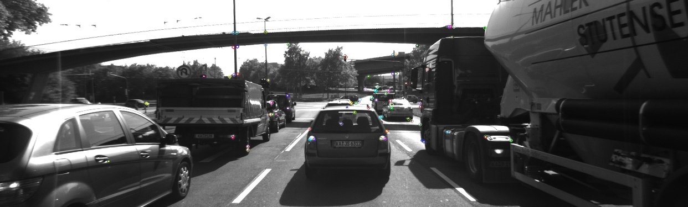
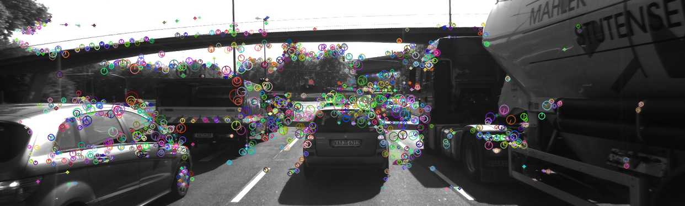

# Write Up for the "Camera Based 2D Feature Tracking" Project

## MP.0 Mid-Term Report

*Provide a Writeup / README that includes all the rubric points and how you addressed each one. You can submit your writeup as markdown or pdf.*

This is the report file.

## MP.1 Data Buffer Optimization

*Implement a vector for dataBuffer objects whose size does not exceed a limit (e.g. 2 elements). This can be achieved by pushing in new elements on one end and removing elements on the other end.*

I changed the code so that the front element is removed when the size is equal to the limit before adding a new element. In this way the size is always at most equal to the limit.

## MP.2 Keypoint Detection

*Implement detectors HARRIS, FAST, BRISK, ORB, AKAZE, and SIFT and make them selectable by setting a string accordingly.*

I implemented the `HARRIS` detector in the `detKeypointsHarris` function in the `matching2D_Student.cpp` file. I used the `cornerHarris` function in OpenCV and then had to look for the local maxima to returns the keypoints. The `FAST`, `BRISK`, `ORB`, `AKAZE` and `SIFT` methods are then implemented in the `detKeypointsModern` function. Their implementation is much simpler as they are implemented as a simple function (the `FAST` method) or as a `FeatureDetector` instance (all the others methods) in OpenCV. The selection is implemented using `if/else` statements.

The following images show the keypoints detected in the last frame using the different methods.

**SHITOMASI**

**HARRIS**

**FAST**

**BRISK**

**ORB**

**AKAZE**

**SIFT**

## MP.3 Keypoint Removal

*Remove all keypoints outside of a pre-defined rectangle and only use the keypoints within the rectangle for further processing.*

I have used the `erase/remove_if` pattern to delete the keypoints that are outside the given rectangle.

## MP.4 Keypoint Descriptors

*Implement descriptors BRIEF, ORB, FREAK, AKAZE and SIFT and make them selectable by setting a string accordingly.*

## MP.5 Descriptor Matching

*Implement FLANN matching as well as k-nearest neighbor selection. Both methods must be selectable using the respective strings in the main function.*

## MP.6 Descriptor Distance Ratio

*Use the K-Nearest-Neighbor matching to implement the descriptor distance ratio test, which looks at the ratio of best vs. second-best match to decide whether to keep an associated pair of keypoints.*

## MP.7 Performance Evaluation 1

*Count the number of keypoints on the preceding vehicle for all 10 images and take note of the distribution of their neighborhood size. Do this for all the detectors you have implemented.*

## MP.8 Performance Evaluation 2

*Count the number of matched keypoints for all 10 images using all possible combinations of detectors and descriptors. In the matching step, the BF approach is used with the descriptor distance ratio set to 0.8.*

## MP.9 Performance Evaluation 3

*Log the time it takes for keypoint detection and descriptor extraction. The results must be entered into a spreadsheet and based on this data, the TOP3 detector / descriptor combinations must be recommended as the best choice for our purpose of detecting keypoints on vehicles.*

